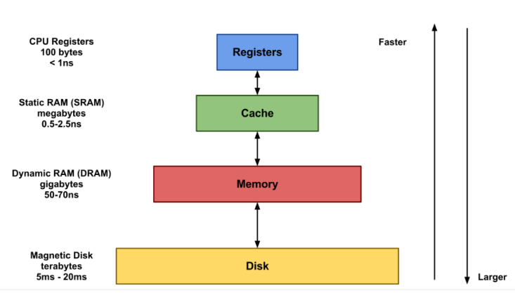

# LRU Cache

> Cache

    캐시는 연산에 필요한 데이터, 값을 미리 갖다놓는 임시 메모리이다. 본래 CPU 에서 주기억장치, 보조기억장치까지 도달하는 비용은 매우 크다. 물리적으로도 거리가 멀다고 할 수 있다. 그런데 캐시의 경우 CPU 바로 옆에 딱 달라붙어있기 때문에 물리적으로 거리가 매우 짧아 접근 비용이 매우 적다. 따라서 자주 사용되는 값이나, 사용될 예정인 값을 미리 캐시에 적재해놓는다면 참조 시간을 대폭 줄여 성능을 높일 수 있다.

    CPU 는 어떤 값이 필요할 때 가장 먼저 캐시를 방문하고 만약 캐시에 원하는 값이 있을 경우 이를 사용하는데, 만약 없다면 주기억 장치를 방문하게 된다. 따라서, CPU 가 자주 사용하는 값, 필요로 하는 값 등을 적절히 캐시에 배치해두어야 한다. 즉, 캐시 히트율을 높여야 성능을 높일 수 있는 것이다.

    위의 설명만 봐도 캐시의 내용물들을 자주 갈아끼워질 필요가 있다. 캐시의 용량은 한정적인데다가 자주 사용되는 값 혹은 사용될 예정인 값은 시시각각 변하기 때문이다. 그런데 막무가내로 내용물을 갈아끼우면 캐시 히트율을 항상 높게 유지하기 어려울 것이고, 성능 악화로 이어질 수 있다. 따라서 캐시 히트율을 높게 유지하는 메모리 교체 알고리즘이 필요하다. 이를 위해 고안된 여러 알고리즘이 있고, 이번 포스팅에선 그 중 하나인 LRU 알고리즘을 적용한 LRU Cache 에 대해 알아보고자 한다.

# LRU (Least Recently Used)

    운영체제의 페이지 교체 알고리즘 중 하나이다. 페이지를 교체할 때 가장 오랫동안 사용되지 않은 페이지를 교체 대상으로 삼는 기법이다.

# LRU Cache

    그렇다면, LRU Cache 는 캐시에 공간이 부족할 때 가장 오랫동안 사용하지 않은 항목을 제거하고 새로운 녀석을 배치하는 형식으로 동작된다고 유추할 수 있다. LRU Cache 의 전제 이론은 '오랫동안 사용되지 않은 항목은 앞으로도 사용되지 않을 가능성이 농후하기 때문에, 가장 오랫동안 참조되지 않은 녀석을 캐시에서 제거하자' 이다. 이 이론에 따라 캐시 메모리를 운영한다면 캐시 히트율을 높게 유지할 수 있다는 가정이 깔려있다. 실제로 성능이 입증됐으며, 가장 많이 사용되는 알고리즘이기도 하다.