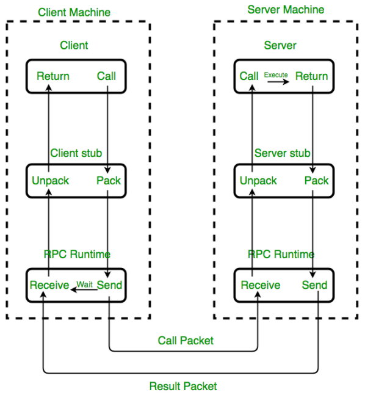
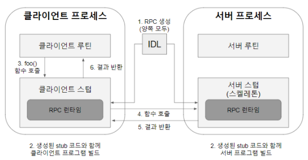

# RPC의 개념

> RPC란?

    RPC(Remote Procedure call)이란, 별도의 원격 제어를 위한 코딩 없이 다른 주소 공간에서 리모트의 함수나 프로시저를 실행 할 수 있게 해주는 프로세스간 통신입니다. 즉, 위치에 상관없이 RPC를 통해 개발자는 위치에 상관없이 원하는 함수를 사용할 수 있습니다.

운영체제를 공부하다 보며 프로세스간 통신을 위해 IPC(inter-Process Communication)을 이용하는 내용을 볼 수 있는데요, RPC는 IPC 방법의 한 종류로 원격지의 프로세스에 접근하여 프로시저 또는 함수를 호출하여 사용하는 방법을 말합니다.

기존에는 프로세스간 통신을 위해 소켓통신, RPC 같은 방식이나 RPC를 활용한 CORBA, RMI 같은 방식을 많이 사용했다면 현재는 웹기술의 발달로 인한 SOAP, REST 등과 같은 방식들이 대세를 이루고 있다고 합니다. 2015년 구글에서는 RPC와 웹기술을 혼합한 gRPC를 처음 발표하기도 했고 많은 사람들의 관심을 받기도 했었죠 

RPC 모델은 분산컴퓨팅 환경에서 많이 사용되어왔으며, 현재에는 MSA(Micro Service Archtecture)에서 마이크로 서비스간에도 많이 사용되는 방식입니다. 서로 다른 환경이지만 서비스간의 프로시저 호출을 가능하게 해줌에 따라 언어에 구애받지 않고 환경에 대한 확장이 가능하며, 좀 더 비지니스 로직에 집중하여 생산성을 증가시킬 수 있습니다.

> 프로시저와 함수?

    RPC를 설명하다 보니 Procedure라는 개념이 소개 되었는데, "프로시저 또는 함수를 호출한다" 라는 내용을 보면 함수와 프로시저에 차이점에 대해서 궁금하실 수 있는데, 함수의 경우 일반적으로 "인풋에 대비한 아웃풋이 발생을 목적"으로 하며, 프로시저는 결과값에 집중하기 보단 "명령 단위가 수행하는 절차"를 의미하는 것을 목적으로 합니다.

 > RPC의 동작 구조

 

> RPC의 동작방식 - IDL 기반

    1. IDL(Interface Definition Language)을 사용하여 서버의 호출 규약을 정의. 
     함수명, 인자, 반환값에 대한 데이터 타입이 저장된 IDL파일을 'rpcgen'컴파일러를 이용하여 Stub 코드를 자동으로 생성.

     * IDL(Interface Definition Language) : 인터페이스 정의 언어. 어느 한 언어에 국한되지 않는 언어 중립적인 방법으로 인터페이스를 표현함으로써, 구현 언어(C, C++, Java 등)가 아닌 정의 언어로, 구현 언어로의 매핑을 지원.

    2. Stub은 원시소스코드 (C, Java 등)의 형태로 만들어지므로, 클라이언트, 서버 프로그램에 각각 포함하여 빌드.     
 
    3. 클라이언트 프로그램 입장에서는 자신의 프로세스 주소공간의 함수를 호출하는 것처럼 보이는데, 클라이언트 stub에 정의된 함수를 호출하는 것임. 

    4. Stub코드는 데이터 타입을 XDR(External Data Representation) 형식으로 변환하여 RPC호출을 실행.

     * XDR 변환 이유 : 기본 데이터 타입(정수형, 부동소수점 등)에 대한 메모리 저장방식(Little-Endian / Big-Endian)이 CPU 아키텍처별로 다르며, 네트워크 전송과정에서 바이트 전송 순서를 보장하기 위함

    5. 서버는 수신된 함수/프로시저 호출에 대한 처리를 서버 Stub을 통해 처리 완료 후, 결과값을 XDR변환하여 Return.

    6. 최종적으로 클라이언트 프로그램은 서버가 Return한 결과값을 전송 받는다. 

출처 : https://co-no.tistory.com/28