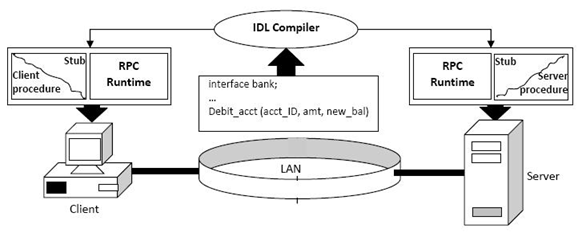

# gRPC(google Remote Procedure Call)

> gRPC란?

    gRPC의 역사는 구글의 데이터센터에서 실행되는 수많은 마이크로서비스들이 10년이상 사용한 단일 범용 RPC 인프라인 Stubby에서 시작됩니다. 구글의 내부시스템은 오래전부터 마이크로서비스 아키텍처를 받아들여 연구해왔고, 내부 서비스들을 연결하기 위해서 Stubby를 만들었습니다. 2015년 3월에 Stubby의 다음 버전을 계획하면서 소스를 오픈하기로 결정하였고, 구글의 내외부 서비스뿐만 아니라 모바일, IOT 등 다양한 엔드포인트(endpoint)에서도 활용하기 위해서 gRPC를 만들었습니다. gRPC는 높은 성능의 오픈소스 범용 RPC 프레임워크입니다.

---

## 왜 gRPC를 써야하는가? 

> 높은 생산성과 효율적인 유지보수

    gRPC는 서비스와 메시지를 정의하기 위해서 Protocol Buffers(이하 ProtoBuf)를 사용합니다. 아래와 같은 ProtoBuf의 IDL만 정의하면 높은 성능을 보장하는 서비스와 메세지에 대한 소스코드가 자동으로 생성됩니다.
```protobuf
// 헤더 부분 생략..
// Greeter 서비스 정의
service Greeter {
  // 서비스의 RPC 정의
  rpc SayHello (HelloRequest) returns (HelloReply) {}
}
// 요청 메시지 정의
message HelloRequest {
  string name = 1;
}
// 응답 메시지 정의
message HelloReply {
  string message = 1;
}
```

    자세한 예제는 뒷 부분에서 다시 다루겠지만, 위와 같은 서비스 정의만으로 서버와 클라이언트(Stub) 코드가 자동으로 생성됩니다. 위 예제의 경우는 sayHello()라는 서비스의 비지니스 로직과 클라이언트에서 Stub을 사용하여 호출해주는 부분만 구현해주면 됩니다.


> HTTP/2 기반의 양방향 스트리밍

    gRPC는 HTTP/2를 기반으로 통신합니다. HTTP/2의 특징과 장점에 대해서는 뒷 부분에서 자세히 다루도록 하겠습니다. HTTP/2에서는 양방향 스트리밍이 가능합니다. 즉, 일반적인 요청/응답 방식이 아니고 서버와 클라이언트가 서로 동시에 데이터를 스트리밍으로 주고 받을 수 있다는 것 입니다. 이 부분도 뒤에서 예제를 통해서 자세히 다루도록 하겠습니다.

> 높은 메시지 압축률과 성능

    HTTP/2의 또다른 장점중에 하나는 HTTP를 사용하는 전송보다 높은 헤더 압축률을 보장한다는 점입니다. gRPC에서는 HTTP/2에 의한 압축뿐만 아니라 protoBuf에 의한 메시지 정의에 의해서 메시지 크기를 획기적으로 줄일 수 있습니다. 메시지의 크기가 줄어드는 것은 곧 네트워크 트래픽이 줄어드는 의미하기 때문에 시스템 리소스를 절약하고 성능을 높일 수 있습니다.

> 다양한 gRPC 생태계
 
    gRPC는 필요에 따라 활용할 수 있는 Authentication, Tracing, Load Balancing, Health Checking, API Gateway 등의 생태계를 가지고 있습니다. 벡엔드 서버를 개발 하다보면 필요한 다양한 추가 기능이나 도구를 꽤 많이 갖추고 있어서 새로운 기술 스택을 추가로 리서치해서 사용할 일이 많지 않습니다.


# gRPC 깊게 보기

> 등장배경


    IPC

    1. Socket
    IPC 기법에는 공유 메모리, PIPE, 메시지 큐 등 여러가지가 있지만 이 중 소켓(socket)을 살펴보겠습니다.

    socket이란, 앞서 언급한 OSI 7 layer 구조의 Application Layer(L7)에서 Transport Port(L4)의 TCP 또는 UDP를 이용하기 위한 수단입니다. 일종의 창구 역할을 하는 것이죠. 목적지와의 통신이 컴퓨터 내부가 아니라 온라인 범위에서 이루어지기 때문에 네트워크 간 통신이라고 구분하기도 하지만, 실질적으로는 로컬 컴퓨터의 프로세스와 원격지 컴퓨터의 프로세스가 IPC 통신을 하는 것입니다.

    소켓은 대부분의 언어에서 API 형태로 제공하는 편리함 때문에 지금도 많이 사용되고 있지만, 일련의 통신 과정을 직접 구현하므로 통신 관련 장애를 처리하는 것은 고스란히 개발자의 몫이 됩니다. 서비스가 고도화될 수록 수백 수천가지 데이터가 돌아다니게 될텐데, 이에 따라 data formatting 을 하는 것도 점점 어려워지게 되죠.

    2. RPC

    이런 소켓의 한계에서 RPC(Remote Procedure Call)라는 기술이 등장합니다. 이름 그대로 네트워크로 연결된 서버 상의 프로시저(함수, 메서드 등)를 원격으로 호출할 수 있는 기능입니다. 네트워크 통신을 위한 작업 하나하나 챙기기 귀찮으니. 통신이나 call 방식에 신경쓰지 않고 원격지의 자원을 내 것처럼 사용할 수 있죠. IDL(Interface Definication Language) 기반으로 다양한 언어를 가진 환경에서도 쉽게 확장이 가능하며, 인터페이스 협업에도 용이하다는 장점이 있습니다.

    ◆ 지원 언어 : C++, Java, Python, Ruby, Node.js, C#, Go, PHP, Objective-C …

    RPC의 핵심 개념은 ‘Stub(스텁)’이라는 것인데요. 서버와 클라이언트는 서로 다른 주소 공간을 사용 하므로, 함수 호출에 사용된 매개 변수를 꼭 변환해줘야 합니다. 안그러면 메모리 매개 변수에 대한 포인터가 다른 데이터를 가리키게 될 테니까요. 이 변환을 담당하는게 스텁입니다.

    client stub은 함수 호출에 사용된 파라미터의 변환(Marshalling, 마샬링) 및 함수 실행 후 서버에서 전달 된 결과의 변환을, server stub은 클라이언트가 전달한 매개 변수의 역변환(Unmarshalling, 언마샬링) 및 함수 실행 결과 변환을 담당하게 됩니다. 이런 Stub을 이용한 기본적인 RPC 통신 과정을 살펴보겠습니다.



    ① IDL(Interface Definition Language)을 사용하여 호출 규약 정의합니다.

    함수명, 인자, 반환값에 대한 데이터형이 정의된 IDL 파일을 rpcgen으로 컴파일하면 stub code가 자동으로 생성됩니다.

    ② Stub Code에 명시된 함수는 원시코드의 형태로, 상세 기능은 server에서 구현됩니다.

    만들어진 stub 코드는 클라이언트/서버에 함께 빌드합니다.

    ③ client에서 stub 에 정의된 함수를 사용할 때,

    ④ client stub은 RPC runtime을 통해 함수 호출하고

    ⑤ server는 수신된 procedure 호출에 대한 처리 후 결과 값을 반환합니다.

    ⑥ 최종적으로 Client는 Server의 결과 값을 반환받고, 함수를 Local에 있는 것 처럼 사용할 수 있습니다.

    RPC는 원격지의 것을 끌어다 로컬처럼 사용하는데다, IDL 기반이라 확장성도 좋고, 개발자도 편해지고 요즘같은 분산 프로그래밍 환경에선 큰 이점을 제공하죠. 그런데 왜 쉽게 찾아볼 수가 없었을까요?

    RPC는 상당히 획기적인 방법론이었으며, 분산 환경의 등장에 따라 함께 발전해 온 오래된 기술입니다. 따라서 구현체도 CORBA, RMI 등 여러가지가 있었는데요. 이들 모두 로컬에서 제공하는 빠른 속도, 가용성 등을 분산 프로그래밍에서도 제공하고 있다고 홍보를 했지만, 정작 구현의 어려움/지원 기능의 한계 등으로 제대로 활용되지 못했습니다. 그렇게 RPC 프로젝트도 점차 뒷길로 가게되며 데이터 통신을 우리에게 익숙한 Web을 활용해보려는 시도로 이어졌고, 이 자리를 REST가 차지하게됩니다.

    3. REST(REpresentational State Transfer)

    REST는 HTTP/1.1 기반으로 URI를 통해 모든 자원(Resource)을 명시하고 HTTP Method를 통해 처리하는 아키텍쳐 입니다. 자원 그 자체를 표현하기에 직관적이고, HTTP를 그대로 계승하였기에 별도 작업 없이도 쉽게 사용할 수 있다는 장점으로 현대에 매우 보편화되어있죠. 하지만 REST에도 한계는 존재합니다. REST는 일종의 스타일이지 표준이 아니기 때문에 parameter와 응답 값이 명시적이지 않아요. 또한 HTTP 메소드의 형태가 제한적이기 때문에 세부 기능 구현에는 제약이 있습니다.

    덧붙여, 웹 데이터 전달 format으로 xml, json을 많이 사용하는데요.

    XML은 html과 같이 tag 기반이지만 미리 정의된 태그가 없어(no pre-defined tags) 높은 확장성을 인정 받아 이기종간 데이터 전송의 표준이었으나, 다소 복잡하고 비효율적인 데이터 구조탓에 속도가 느리다는 단점이 있었습니다. 이런 효율 문제를 JSON이 간결한 Key-Value 구조 기반으로 해결하는 듯 하였으나, 제공되는 자료형의 한계로 파싱 후 추가 형변환이 필요한 경우가 많아졌습니다. 또한 두 타입 모두 string 기반이라 사람이 읽기 편하다는 장점은 있으나, 바꿔 말하면 데이터 전송 및 처리를 위해선 별도의 Serialization이 필요하다는 것을 의미합니다.

    

출처 : https://medium.com/@goinhacker/microservices-with-grpc-d504133d191d