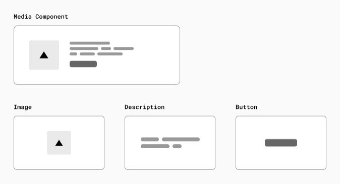

# Next.js

> What is React?

리액트는 자바스크립트 라이브러리로 유저 인터페이스를 빌딩하는데 사용된다.
리액트는 다양한 서드파티 어플리케이션과의 연동등을 제공하지만 그 말은 개발자가 들여야 하는 수고가 많다는 뜻이다. 

> What is Next.js?

next.js는 리액트 프레임워크로 웹애플리케이션을 만들때 빌딩블럭을 제공해준다.

> React Core Concepts

1. Components
2. Props
3. State

> Building UI with Components

UI는 component라고 불리는 빌딩블럭으로 작게 나뉘어 진다.

아래와 같은 모습이다.

> Next.js의 특징

1. Compiler

        Next.js는 Rust로 쓰인 컴파일러를 가지고있다. 
        그렇다면 컴파일러가 왜 필요한 걸까?

        개발자들은 보통 JSX같은 개발 친화적인 언어를 이용하여 코드를 짠다. 이런 것들은 개발속도를 향상시키는 장점이 있지만 브라우저에서 읽을 때 Javascript로 컴파일 되어야 한다.

2. Minifying 

        개발자는 코드를 가독성이 좋게 짜려고 한다. 그러다 보면 코드에는 실행에 필요하지 않은 코드들이 존재하게 된다. 예를들면 공백문자, 주석 등이 있다.

        Minifying은 이러한 코드들을 모두 제거하는것을 의미한다.

        Next.js에서는 JS나 CSS파일은 전부 자동으로 Minifying된다.

3. Bundling

        개발자들은 앱을 모듈, 컴포넌트, 함수 단위로 쪼개서 개발한다. 이러한 것들은 file dependency가 복잡해 지게 된다.

        Bundling은 의존성을 해결하고 파일들을 실행하기에 최적으로 병합하는 역할을 한다. 

4. Splitting

        Splitting은 각 entry point에 렌더링이든 뭐든 하기위해 Bundling한 것을 풀어 헤치는 느낌이다. 

> Build Time and Runtime

1. Build Time

        Build Time에는 Next.js가 코드를 서버에 배포하기 위한 최적의 코드로 변환한다. 정적 페이지의 경우는 HTML, 서버 렌더링 페이지의 경우는 JS코드, 클라이언트 상호작용 코드는 JS코드, CSS등.. 

> Rendering 

* Pre-Rendering

    서버사이드 렌더링과 정적 사이트는 pre-rendering이라고 부른다. 외부 데이터를 끌어오는것과 React 컴포넌트를 html로 변환하는 과정이 결과를 client로 보내기 전에 이루어 지기 때문이다. 

* Client-Side Rendering vs. Pre-Rendering

    Client-side Rendering의 경우는 사용자가 빈 HTML 파일과 JS파일을 받는다. 사용자 브라우저에서 이것을 활용하여 첫 렌더링이 이루어지는 것이다.

    그와 반대로 next.js에서는 기본적으로 모든 페이지를 pre-renders 한다.

    이는 서버에서 HTML을 미리 생성한다는 의미이다. 

    Server-side Rendering의 경우는 요청이 올 때 마다 HTML페이지를 만들어서 보낸다. 사용자와 상호작용하기위한 JS를 포함해 JSON data, HTML을 같이 보낸다.

* Static Site Generation

    HTML이 서버에서 생성된다. 서버 사이드와의 차이점이라면 여기서는 런타임에서 서버가 없다. 대신 빌드타임에 컨텐츠가 딱 한번 생성되고 배포된다. 그리고 HTML은 CDN에 저장되고 다음 request부터 재사용된다.

    