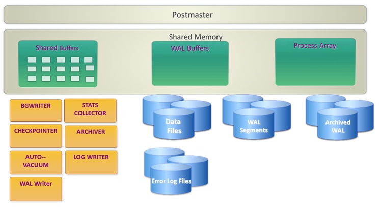
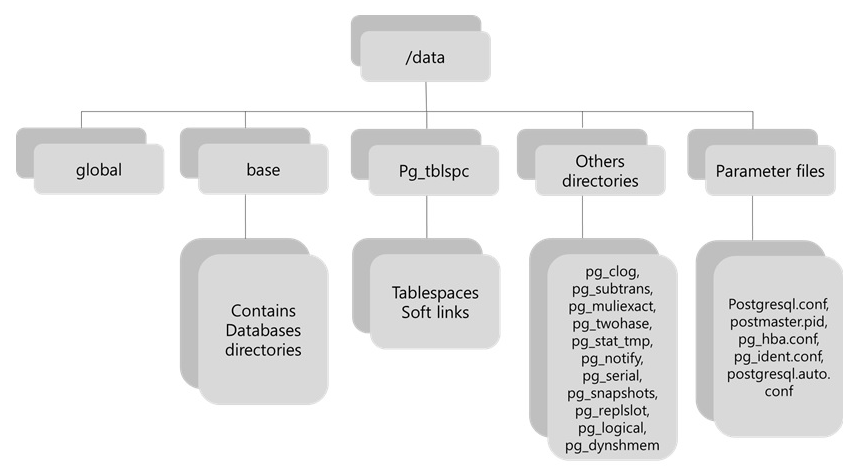

# PostgreSQL Lineage

    PostgreSQL은 Ingres(INteractive Graphics REtrieval System)에 뿌리를 두고 있다

    초기 개발 단계부터 완벽한 ACID와 MVCC를 지원하는 아키텍쳐로 설계된 PostgreSQL은 대용량의 복잡한 트랜잭션 처리를 위한 RDBMS이다.

    과거 IBM에서 작성된 RDBMS의 화이트페이퍼를 기반으로 Oracle, DB2 그리고 PostgreSQL이 구현되었기 때문에 mysql이나 mariaDB와 같은 오픈소스 제품과 달리 PostgreSQL의 경우 상용RDBMS 급의 기능을 제공한다고 할 수 있다.

# PostgreSQL Process & Memory Architecture

    PostgreSQL의 경우 process 기반으로 동작한다.

    포스트마스터(Postmaster)라는 main process가 있으며, child process로 유틸리티 프로세스가 실행되어 동작된다. Postmaster에서는 유틸리티 프로세스가 죽으면 restart 시킨다.

    사용자 Session에 대해서는 한 개에 백앤드 프로세스가 실행된다. Postmaster에서 새로운 connection을 맺는다.

# PostgreSQL Physical Database Architecture
    "Cluster"는 하나의 서버 인스턴스에 의해 관리되는 여러 Database의 모음이다.

    Cluster에 대한 구분은 아래 3가지로 할 수 있다.

    - Data directory
    - TCP Port
    - Set of processes
    
    하나의 cluster는 여러 개의 Database를 구성할 수 있다.

출처 : http://www.gurubee.net/lecture/288/

# Postgresql 조작

    createdb mydb

    psql mydb

    위 명령어를 이용하여 db를 만들고 접속했음 .

# PostgreSQL의 데이터베이스 스키마, 테이블의 관계

> 스키마

    PostgreSQL에서 실제 데이터는 테이블에 저장된다. 테이블은 목적에 따라 여러 개 만들 수 있고 그것을 정리된 것이 데이터베이스이며, 거기에 PostgreSQL에서는 데이터베이스에 스키마라는 것이 있다.

    스키마는 데이터베이스에 작성되는 테이블이나 함수 등의 개체를 그룹화하는 것이다. 스키마가 다르면 동일한 데이터베이스에도 동일한 테이블 이름으로 테이블을 만들 수 있다. 데이터베이스를 작성하면 자동으로 public라는 특별한 스키마가 작성된다.

    public 스키마는 기본적으로 모든 역할에 권한과 CREATE 권한이 부여되며, public 스키마에 어떤 역할도 테이블을 만들 수 있다.

    public 스키마와는 별도로 스키마를 데이터베이스에 만들 수 있다. 다른 데이터베이스 시스템에서는 사용자 이름과 동일한 이름의 스키마 이름을 가진 스키마만 작성할 수 없는 것도 있지만, PostgreSQL에서는 모든 이름의 스키마를 만들 수 있다.

> 테이블

    테이블은 스키마에 작성한다. 스키마가 다르면 같은 테이블 이름의 테이블도 만들 수 있다. 또한 스키마마다 테이블 등의 오브젝트를 작성할 수있는 권한을 설정할 수 있다.

    CREATE TABLE 명령으로 테이블을 만들 경우 테이블 이름에 스키마를 생략하면 기본적으로 public 스키마에 테이블이 만들어 진다. (역할 이름과 같은 스키마가 생성 된 경우는 제외)

