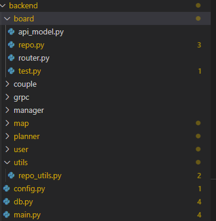

# FastApi Architecture

공식문서의 FastApi Architecture는 아래를 추천한다.

    .
    ├── app
    │   ├── __init__.py
    │   ├── main.py
    │   ├── dependencies.py
    │   └── routers
    │   │   ├── __init__.py
    │   │   ├── items.py
    │   │   └── users.py
    │   └── internal
    │       ├── __init__.py
    │       └── admin.py

본인의 경우는 기능별로 코드를 관리할 수 있게 router와 db관련 정보들을 기능별 폴더로 정리했다. 구조는 아래와 같다

