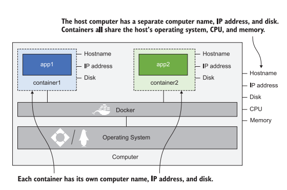
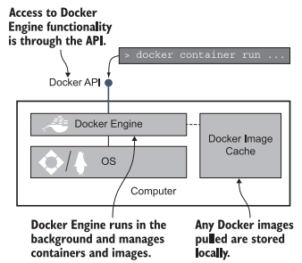
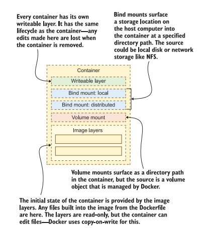

# Cleanup Commannd

    - Clean up
    docker container rm -f $(docker container ls -aq)

    - Reclaim
    docker image rm -f $(docker image ls -f reference='diamol/*' -q)


# Docker Container의 구조

    
    도커는 위 그림과 같이 전체적으로는 하나의 컴퓨터에서 CPU, Memory를 공유하면서 컨테이너가 독립적으로 자신의 컴퓨터 ID, IP address 저장공간을 가진다. 

    여기서 무엇이 중요하냐 하면 프로그래밍에서 주로 발생하는 두가지 문제점을 해결할 수 있다는 것이다.

    Density와 Isolation이다.

    Density의 경우 많은 어플리케이션을 하나의 컴퓨터로 돌릴 때 제한사항이 많다는 점이다. 다양한 버전의 앱, 부적합한 버전의 툴과 라이브러리를 하나의 컴퓨터에서 관리하다보니 충분히 많은 앱을 한 컴퓨터로 돌리기 어려워진다.
    
    원래는 VM(Virtual Machine)으로 이 문제를 해결하려고 시도했었다.

    하지만 VM은 독립적으로 OS를 포함하고있어 사용하는데 커다란 코스트가 든다.

## Connecting to a Container like a remote computer

    본인의 OS에 따라 -it 옵션으로 컨테이너를 실행했을때 사용하는 명령어가 달라진다.


## Docker WorkFlow


    위 그림과 같이 Docker Engine은 Docker 컴포넌트를 관리한다. local image cache를 관리하고 새로운 이미지를 다운받거나 다시 사용할때 이것을 활용한다. 

    Docker Engine은 새로운 피쳐들을 HTTP베이스의 REST API인 Docker API를 통해 만들어내는데 로컬 컴퓨터로만 이 API에 접근할 수 있게 engine을 설정할수도 있다.

    Docker command-line interface(CLI)는 Docker API의 클라이언트이다. 우리가 Docker command를 실행할 때, CLI는 Docker API로 요청을 보내고 Docker Engine이 실행된다. 


# Dockerfile

> web-ping Dockerfile
```dockerfile
FROM diamol/node

ENV TARGET="blog.sixeyed.com"
ENV METHOD="HEAD"
ENV INTERVAL="3000"

WORKDIR /web-ping

COPY app.js .

CMD ["node", "/web-ping/app.js"]
```

    FROM - 모든 이미지는 다른 이미지로부터 시작된다. 위 예시의 경우는 web-ping이라는 이미지가 diamol/node로 시작된다는 것을 알 수 있다. 기본적으로 node.js가 설치되어있고 여기에 web-ping이 사용할 모든 것이 들어있다.

    ENV - 환경변수의 모음이다. 문법은 KEY="VALUE"로 작성하면 된다.

    WORKDIR - container image filesystem에서 새로운 폴더를 만든다. 그리고 그 폴더를 현재 작업폴더로 설정한다. 

    COPY - 파일들이나 폴더들을 로컬 컴퓨터에서 컨테이너 이미지로 복사한다. 문법은 [source path] [target path] 로 작성한다.

    CMD - 도커가 시작할때 실행되는 커맨드를 명시한다. 여기서는 node.js를 실행시키고 app.js파일을 실행시킨다.


# Docker image layer

    도커 이미지는 image 레이어의 logical collection이다. 
    각 레이어들은 도커엔진의 캐시에 피지컬하게 저장되어있다.


# Docker build multi-stage

```Dockerfile
FROM diamol/base AS build-stage
RUN echo 'Building...' > /build.txt
FROM diamol/base AS test-stage
COPY --from=build-stage /build.txt /build.txt
RUN echo 'Testing...' >> /build.txt
FROM diamol/base
COPY --from=test-stage /build.txt /build.txt
CMD cat /build.txt
```

    이렇게 되면 diamol/base를 빌드하고 build.txt에 삽입한 텍스트를 연달아서 from 속성으로 받아오고 최종적으로 마지막 빌드때 모두 출력한다. 두번째 빌드때부터는 캐싱되어있는 레이어를 사용한다.


# Docker Hub에 배포

    docker tag 명령어로 image-gallery의 이름을 $dockerId/image-gallery:v1로 태그와 이름을 바꾸어주었다. 

    docker push 명령어를 통해 이미지를 푸시해줄수 있다. 아래 예시
    
    docker image push $dockerId/image-gallery:v1

    https://hub.docker.com/r/$dockerId/image-gallery/tags
    
    위 링크로 가면 도커 허브 해당 레포지터리 관리 페이가 나온다.


# Docker Registry

    Docker Hub에 Public으로 이미지를 배포할 수 있지만 로컬 Repository에서 Docker Image를 푸시할수도 있다. 이때 Docker Registry를 사용한다.

    Docker Registry는 퓨 docker registry 도커파일을 실행시킨다.

    아래는 예시

    docker container run -d -p 5000:5000 --restart always diamol/registry

    그리고 현재 컴퓨터의 네트워크 이름에 별명을 추가하기 위해 아래 명령어를 입력

    echo $'\n127.0.0.1 registry.local' | sudo tee -a /etc/hosts

    이제 도메인명 registry.local:5000으로 서버에 접속할 수 있다.


# Docker Volume

    docker container cp xxx.~ xxx.~
    을 통해 도커 컨테이너 내부파일을 로컬로 복사해올 수 있다.

    Mount의 한계점
    
    * straightforward

    - target폴더에 이미 데이터가 존재한다면 source폴더랑 병합될것이라 생각하는데 이것은 아니다. target폴더안에 이미 데이터가 있더라도 source폴더로 대체된다. 이 점이 문제점이다. 

    * singlefile mount
  
    - singlefile mount는 윈도우에서는 지원이 안된다.

    * less common

    - 분산 파일 시스템 ( cloud )에서는 파일시스템에서 지원하는 기능이 다를 수 있어서 빌드에 실패할 가능성이 높다. 

# Docker System




> Writable Layer

    이 레이어는 각 컨테이너마다 유니크하게 존재하고 컨테이너가 사라지면 같이 사라진다. 

> Local bind mounts

    host와 컨테이너간의 데이터를 공유하기 위해 사용된다. 개발자는 그들의 컴퓨터에서 소스코드를 로드해서 컨테이너에 마운트할 수 있다. 그래서 로컬에서 HTML이나 Javascript를 즉시 수정해서 컨테이너의 재빌드 없이 변화를 만들어낼 수 있다.

> Distributed bind mounts

    network storage와 컨테이너간의 데이터 공유를 위해 사용된다. 매우 유용하지만 로컬 파일 시스템 처럼 훌륭한 퍼포먼스나 완벽한 피쳐를 제공하지는 않는다는 점을 명심해야 한다. 같은 네트워크상의 머신이나 컨테이너에서 데이터를 공유하기 위해 사용될 수 있다.

> Volume mounts

    컨테이너와 도커에서 관리되는 storage object 간의 데이터를 공유하기위해 사용된다. 영속적 저장소로써 매우 유용하다. 새로운 컨테이너로 앱을 업그레이드 해도 해당 볼륨을 사용하면 이전 버전의 데이터를 가져올 수 있다.

> Image layers

    이 레이어는 컨테이너의 시작을 알리는 파일시스템이다. 계층들은 각자 쌓이고 가장 아랫 레이어부터 쌓이면서 오버라이딩된다. 해당 레이어들은 read only이고 다른 컨테이너와 공유될 수 있다.

# Docker Compose

    depend on : ~~

    ~~ 가 실행되는것을 확인하고 실행됨.

    
# Docker Health Check And Dependency check

    기본적인 health check가 아니라 컨테이너 내부의 웹서버가 500에러를 발생해도 컨테이너에서 헬스체크를 할 수 있는 수준. 

    Dockerfile에서 
    HEALTHCHECK CMD curl --fail http://localhost/health
    로 헬스체크 가능

    depend check할때 왜 귀찮게 depend_on flag를 사용하지않고 명령으로 진행하는가? 
    => 답은 compose는 싱글머신으로 디펜던시를 관리하기 때문에 앱의 시작행동에서 벌어지는 일들을 모두 예측하기 힘들다. 

# Adding observability with containerized monitoring


> Prometheus

    프로메테우스를 사용하는것의 큰 장점은 컨테이너간의 지속성을 보장한다는 것이다. 어떤 형태의 컨테이너든 동일한 타입의 metrics를 export할 수 있다. 

    프로메테우스 서버를 같이 돌려준다.
    
    프로메테우스 config.yaml을 작성 한 후 docker compose -f config.yaml up 명령을 통해 적용해준다.

> Grafana

    