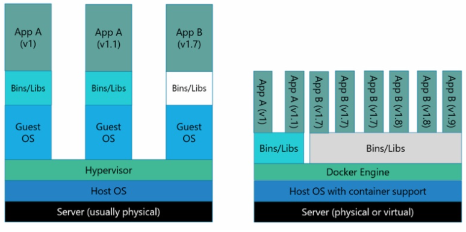
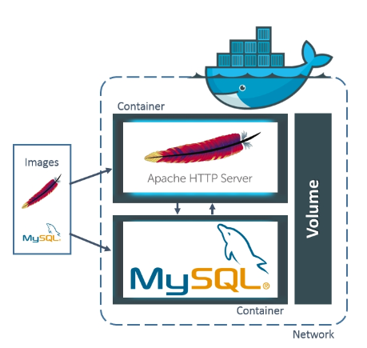
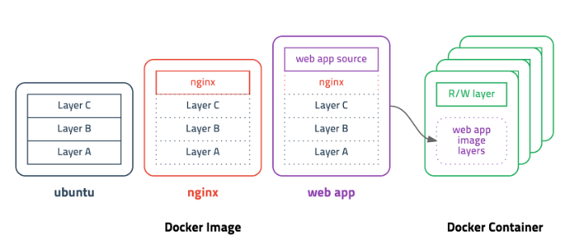

# Docker란

    Go언어로 작성된 리눅스 컨테이너 기반으로하는 오픈소스 가상화 플랫폼이다.
    현재 Docker 0.9버전 부터는 직접 개발한 libcontainer 컨테이너를 사용하고 있다.

> 가상화를 사용하는 이유는?

    이제는 향상된 컴퓨터의 성능을 더욱 효율적으로 사용하기 위해 가상화 기술이 많이 등장하였습니다..
    
    서버 관리자 입장에서 CPU사용률이 10%대 밖에 되지 않는 활용도가 낮은 서버들의 리소스 낭비일 수밖에 없습니다.  그렇다고 모든 서비스를 한 서버안에 올린다면 안정성에 문제가 생길수도 있습니다. 그래서 안정성을 높이며 리소스도 최대한 활용할 수 있는 방법으로 나타난게 서버 가상화입니다. 모두가 아는 대표적인 가상화 플랫폼으로는 VM이 있습니다. VM은 누구나 아는 OS가상화지요. 그렇다면 컨테이너란 무엇일까요?

> 컨테이너란?

    컨테이너는 가상화 기술 중 하나로 대표적으로 LXC(Linux Container)가 있습니다. 기존 OS를 가상화 시키던 것과 달리 컨테이너는 OS레벨의 가상화로 프로세스를 격리시켜 동작하는 방식으로 이루어집니다.
    
    한 서버의 여러 OS를 가상화 하여 사용하는 것과 컨테이너 방식으로 프로세스를 격리시켜 동작하는 방법은 어떠한 차이점이 있을까요?

> VM 가상화 플랫폼 vs Docker 가상화 플랫폼



    기존에 우리에게 익숙한 VM같은 경우엔 Host OS 위에 가상화를 시키기 위한 Hypervisor 엔진 그리고 그 위에 Guest OS를 올려 사용합니다. 이는 가상화된 하드웨어 위에 OS가 올라가는 형태로 거의 완벽하게 Host와 분리된다고 봐도 무방합니다. 반면에 컨테이너 기반 가상화는 Docker 엔진 위에 Application 실행에 필요한 바이너리만 올라가게 됩니다. OS 가상화를 보면 Host OS와 완전히 분리되는 장점은 있지만 OS위에 OS를 올리기 때문에 무겁고 느릴수 밖에 없습니다. 하지만 컨테이너 기반 가상화는 Host OS 그리고 Docker 엔진위에서 바로 동작하며 Host의 커널을 공유합니다. 커널을 공유하게 되면 io처리가 쉽게 되어 성능의 효율을 높일 수 있습니다.

    컨테이너를 사용하는 것은 가상 머신을 생성하는 것이 아니라 Host OS가 사용하는 자원을 분리하여 여러 환경을 만들 수 있도록 하는 것입니다. 
    
    이렇게 쓰고보니 컨테이너기반이 OS가상화보다 뛰어나다라고 말하는 것 같지만 그렇지는 않습니다.

    Docker를 소개하는 포스트인만큼 OS가상화에 비해 컨테이너기반의 가상화가 좋은점을 강조하며 Docker를 왜 쓰는지에 대해 설명을 한 것입니다.

    OS가상화는 컨테이너기반 가상화보다 더 높은 격리 레벨을 지원합니다. 이는 보안적인 측면에서 더욱 유리합니다.
    또한 OS가상화의 커널을 공유하지 않는 장점 또한 있습니다. 커널을 공유하지 않는 만큼 멀티 OS가 가능하다는 것입니다. 커널을 공유하지 않아 멀티 OS가 불가능 하다는 것은 Linux위에 Window를 올릴 수 없다는 단점이 있는 것이죠. 그럼에도 왜 Docker를 쓰는 이유는 성능향상, 뛰어난 이식성, 쉽게 Scale Out을 할 수 있는 유연성이라고 생각합니다.

> Docker Image



    Docker Image란 컨테이너를 실행할 수 있는 실행파일, 설정 값 들을 가지고 있는 것이라고 생각 하면 됩니다.
    그림과 같이 Image를 컨테이너에 담고 실행을 시킨다면 해당 프로세스가 동작하게 되는 것이죠.

    그럼 어떻게 이미지가 만드는지 알기 위해선 어떻게 이미지가 만들어지는지 먼저 알아보도록 하겠습니다.



    다음 그림을 보면 ubuntu 이미지를 만들기 위해 Layer A,B,C가 들어갑니다. 그럼 nginx 이미지를 만든다고 생각했을땐 어떻게 될까요? 이미 Layer A,B,C로 만들어진 ubuntu 이미지를 베이스 이미지로 사용하여 베이스 이미지에 nginx만 더하게 됩니다. 그렇다면 실질적으로 Layer A, B, C, nginx 가 더해진 것이지만 과정은 ubuntu + nginx가 더해진 것이죠. 그렇다면 web app 이미지를 만들려고 할 땐 어떻게 될까요? ubuntu 이미지에 nginx를 올리고 web app을 올리는 것이 아닌 이미 만들어진 nginx 베이스 이미지에 web app을 올려 이미지를 만들게 됩니다.
    이제 이미지가 어떻게 만들어지는지 알았다면 실제로 Image를 만들어보는 Docker File에 대해 알아봅시다.

> Docker File

    뒤에서도 설명을 하겠지만 Docker Image들을 저장하고 배포하는 Docker Hub는 정말 잘 활성화 되어 있습니다. 이미 여러 회사들은 소프트웨어를  Docker Hub를 통해 배포하기 시작했고 우린 Docker hub에서 image를 pull하여 간단하게 컨테이너에 넣어 사용할 수 있습니다. 하지만 이는 무엇인가 부족해 보이죠. 만약 배포판이 없다면? 배포판 보다 더욱 보완하고 싶다면? 그럴때 사용 할 수 있는 것이 Docker Fille입니다.
    Docker File은 이미지 생성 출발점으로 이미지를 구성하기 위한 명령어들을 작성하여 이미지를 구성할 수 있습니다. 그 뜻은 Docker File을 읽을 수만 있다면 해당 이미지가 어떻게 구성되어 있는지도 알 수 있다는 의미가 됩니다.

```Dockerfile
FROM jdk8:latest
    
WORKDIR /app

RUN mkdir /app/nexus-2.14.9-01
RUN mkdir /app/sonatype-work
RUN yum -y install httpd

ENV JAVA_HOME /usr/local/jdk1.8.0_181
ENV PATH=$JAVA_HOME/bin:$PATH
ENV CLASSPATH=.

EXPOSE 3411 
ADD run.sh /app/
           
CMD ["/app/run.sh"]
```

출처 : https://khj93.tistory.com/entry/Docker-Docker-%EA%B0%9C%EB%85%90